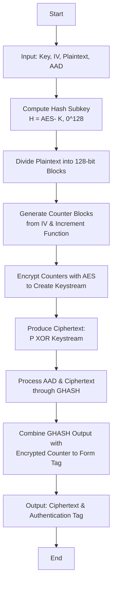

# GCM Protocol (Galois/Counter Mode) Documentation

GCM (Galois/Counter Mode) is a widely used authenticated encryption mode that simultaneously provides confidentiality and data integrity. This document explains the GCM protocol in detail, its underlying components, and the flow of operations—with visual aids and icons to help students understand each step.

---

## 📷 GCM Protocol Diagram

  

---

## 📝 Explanation of the Diagram

This diagram gives a visual overview of the GCM protocol, showing how encryption and authentication work together:

- **🔑 Initialization Vector (IV) Integration:**  
  The IV is a unique nonce used to derive the initial counter block. For optimal performance, a 96-bit IV is recommended. It is concatenated with a fixed suffix (typically 31 zero bits followed by a 1) to form the starting counter value.

- **🔐 Counter Mode Encryption (CTR):**  
  Successive counter blocks are generated by incrementing the initial counter value. Each counter block is encrypted using a block cipher (like AES), producing a pseudorandom keystream that is then XORed with the plaintext to generate the ciphertext.

- **🛡️ GHASH Authentication:**  
  In parallel with encryption, the ciphertext and any additional authenticated data (AAD) are fed into the GHASH function:
  - **Data Preparation:** The ciphertext and AAD are split into 128-bit blocks (with padding applied if necessary).
  - **Hash Subkey Generation:** A subkey `H` is computed by encrypting an all-zero 128-bit block with the encryption key.
  - **Iterative Processing:** Starting with an initial value of zero, each data block is combined (using XOR) and multiplied by `H` in the finite field GF(2^128). This iterative process produces a single 128-bit authentication value.
  - **Tag Formation:** This authentication value is then mixed with an encrypted counter block (derived from the IV) to form the final authentication tag.

- **📦 Output Combination:**  
  The final output includes both the ciphertext and the authentication tag. This ensures that the recipient can verify the data’s integrity and authenticity while decrypting it.

---

## 📚 Key Concepts

- **Authenticated Encryption:**  
  GCM offers both encryption (to protect the data's confidentiality) and authentication (to ensure the data has not been modified).

- **Parallel Processing:**  
  Both the counter mode encryption and GHASH computations are highly parallelizable, enabling high throughput—critical for modern network applications.

- **Finite Field Arithmetic:**  
  GHASH operates in GF(2^128) using operations such as XOR (for addition) and specialized multiplication modulo an irreducible polynomial (typically `x^128 + x^7 + x^2 + x + 1`). This mathematical approach ensures that even tiny changes in the input produce a dramatically different authentication output.

---

## ⚙️ Detailed Operation

### 1. Inputs

- **Secret Key (K):**  
  The encryption key used with the block cipher (e.g., AES).

- **Initialization Vector (IV):**  
  A unique nonce (ideally 96 bits) that ensures each encryption operation is unique.

- **Plaintext (P):**  
  The original data to be encrypted.

- **Additional Authenticated Data (AAD):**  
  Data that is not encrypted but is still authenticated. AAD typically includes protocol headers, metadata, timestamps, or any other associated information that must remain in plaintext while still being protected against tampering. During the authentication process, AAD is processed alongside the ciphertext within the GHASH function so that any modifications to this data can be detected upon decryption.

### 2. Encryption (CTR Mode)

**Encryption using CTR Mode proceeds as follows:**

1. **Block Division & Counter Generation:**  
   The plaintext is divided into 128-bit blocks. A counter block is generated from the Initialization Vector (IV) (typically 96 bits combined with a fixed suffix) and is incremented for each block.

2. **Keystream Generation:**  
   Each counter block is encrypted with AES to produce a pseudorandom keystream block.

3. **Ciphertext Production:**  
   Each plaintext block is XORed with the corresponding keystream block to produce the ciphertext block. This is represented as:  
   $$C_i = P_i \oplus \text{Keystream}_i$$

### 3. GHASH Authentication

**Purpose (Why We Need GHASH):**  
GHASH functions as a “fingerprint” for your encrypted data and any associated data (AAD). It ensures that if even a single bit of the ciphertext or AAD is altered, the final computed fingerprint (and hence the authentication tag) will not match, allowing the receiver to detect tampering.

**Detailed Process (How GHASH Works):**

1. **Data Preparation:**  
   - **Block Splitting:**  
     Both the ciphertext and any AAD (for example, protocol headers) are split into 128-bit blocks. If the final block in either sequence is shorter than 128 bits, it is padded with zeros.
   - **Length Block:**  
     An extra block is appended that encodes the bit-lengths of the AAD and the ciphertext. This extra block is represented as:  
      $$\text{len}(A) \, \| \, \text{len}(C)$$  
     where the first 64 bits represent the length of the AAD in bits and the next 64 bits represent the length of the ciphertext in bits.

2. **Hash Subkey Calculation:**  
   A hash subkey $$H$$ is computed by encrypting an all-zero 128-bit block with the AES key:  
     $$H = \text{AES}(K, 0^{128})$$  
   This subkey is then used throughout the GHASH computation.

3. **Iterative Computation:**  
   - **Initialization:**  
     Start with an initial accumulator:  
     $$Y_0 = 0$$
   - **Block Processing:**  
     For each 128-bit block $$S_i$$ (which includes blocks derived from the AAD, the ciphertext, and the appended length block), compute:  
       $$Y_i = (Y_{i-1} \oplus S_i) \otimes H$$
     where:
     - $$\oplus$$ denotes the XOR operation (a bitwise “add without carrying”).
     - $$\otimes$$ denotes multiplication in the finite field $$\mathrm{GF}(2^{128})$$.

4. **Understanding $$\mathrm{GF}(2^{128})$$:**
   - **Finite Field:**  
     $$\mathrm{GF}(2^{128})$$ is a finite field containing exactly $$2^{128}$$ elements, with each element represented as a 128-bit binary number.
   - **Addition in $$\mathrm{GF}(2^{128})$$:**  
     Instead of standard addition, numbers are added using the XOR operation—each corresponding bit is added without carrying.
   - **Multiplication in $$\mathrm{GF}(2^{128})$$:**  
     Multiplication is carried out by interpreting the 128-bit numbers as polynomials with binary coefficients (0 or 1). The resulting product is then reduced modulo an irreducible polynomial (commonly):  
       $$x^{128} + x^7 + x^2 + x + 1$$  
     This reduction ensures that the product remains a 128-bit number.
   - **Why It Matters:**  
     This arithmetic thoroughly mixes the bits so that even the smallest change in the input produces a dramatically different output—a key property for detecting any tampering.

5. **Tag Formation:**  
   After all blocks have been processed, the final GHASH result (i.e., the combined fingerprint) is XORed with an encrypted counter block (derived from the IV) to form the final authentication tag. The tag is then truncated (if necessary) to the desired length and sent along with the ciphertext. Upon decryption, the receiver recalculates the GHASH and verifies that the tag matches, confirming data integrity and authenticity.

This revised documentation clarifies both the encryption (CTR mode) flow and the GHASH authentication process, including the explicit calculation for incorporating the bit-lengths of the AAD and ciphertext.

### 4. Output

- **Ciphertext (C):**  
  The encrypted version of the original plaintext. If an attacker can’t break the encryption key, they can’t read the contents.

- **Authentication Tag (T):**  
  A small piece of data (often 16 bytes or less) that proves the ciphertext and AAD haven’t been tampered with. If even one bit of the message changes, the tag won’t match.

---
## 🗺️ Mermaid Diagram of GCM Flow

