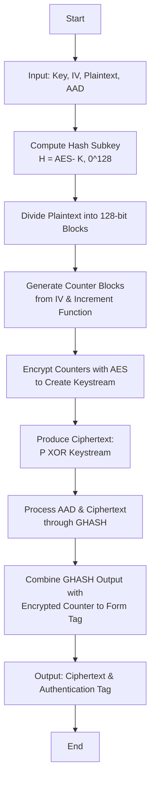

# GCM Protocol (Galois/Counter Mode) Documentation

GCM (Galois/Counter Mode) is a widely used authenticated encryption mode that simultaneously provides confidentiality and data integrity. This document explains the GCM protocol in detail, its underlying components, and the flow of operations—with visual aids and icons to help students understand each step.

---

## 📷 GCM Protocol Diagram

  

---

## 📝 Explanation of the Diagram

This diagram gives a visual overview of the GCM protocol, showing how encryption and authentication work together:

- **🔑 Initialization Vector (IV) Integration:**  
  The IV is a unique nonce used to derive the initial counter block. For optimal performance, a 96-bit IV is recommended. It is concatenated with a fixed suffix (typically 31 zero bits followed by a 1) to form the starting counter value.

- **🔐 Counter Mode Encryption (CTR):**  
  Successive counter blocks are generated by incrementing the initial counter value. Each counter block is encrypted using a block cipher (like AES), producing a pseudorandom keystream that is then XORed with the plaintext to generate the ciphertext.

- **🛡️ GHASH Authentication:**  
  In parallel with encryption, the ciphertext and any additional authenticated data (AAD) are fed into the GHASH function:
  - **Data Preparation:** The ciphertext and AAD are split into 128-bit blocks (with padding applied if necessary).
  - **Hash Subkey Generation:** A subkey `H` is computed by encrypting an all-zero 128-bit block with the encryption key.
  - **Iterative Processing:** Starting with an initial value of zero, each data block is combined (using XOR) and multiplied by `H` in the finite field GF(2^128). This iterative process produces a single 128-bit authentication value.
  - **Tag Formation:** This authentication value is then mixed with an encrypted counter block (derived from the IV) to form the final authentication tag.

- **📦 Output Combination:**  
  The final output includes both the ciphertext and the authentication tag. This ensures that the recipient can verify the data’s integrity and authenticity while decrypting it.

---

## 📚 Key Concepts

- **Authenticated Encryption:**  
  GCM offers both encryption (to protect the data's confidentiality) and authentication (to ensure the data has not been modified).

- **Parallel Processing:**  
  Both the counter mode encryption and GHASH computations are highly parallelizable, enabling high throughput—critical for modern network applications.

- **Finite Field Arithmetic:**  
  GHASH operates in GF(2^128) using operations such as XOR (for addition) and specialized multiplication modulo an irreducible polynomial (typically `x^128 + x^7 + x^2 + x + 1`). This mathematical approach ensures that even tiny changes in the input produce a dramatically different authentication output.

---

## ⚙️ Detailed Operation

### 1. Inputs

- **Secret Key (K):**  
  The encryption key used with the block cipher (e.g., AES).

- **Initialization Vector (IV):**  
  A unique nonce (ideally 96 bits) that ensures each encryption operation is unique.

- **Plaintext (P):**  
  The original data to be encrypted.

- **Additional Authenticated Data (AAD):**  
  Data that is not encrypted but is still authenticated. AAD typically includes protocol headers, metadata, timestamps, or any other associated information that must remain in plaintext while still being protected against tampering. During the authentication process, AAD is processed alongside the ciphertext within the GHASH function so that any modifications to this data can be detected upon decryption.

### 2. Preprocessing
- **Hash Subkey (H):**  
  Compute the hash subkey by encrypting an all-zero 128-bit block:

**H = AES(K, $$0^{128}$$)**

This subkey is then used in the GHASH function.

### 3. Encryption (CTR Mode)
- **Block Division & Counter Generation:**  
  The plaintext is split into 128-bit blocks. A counter is generated from the IV (as explained above) and incremented for each block.
- **Keystream Generation:**  
  Each counter block is encrypted with AES to generate a keystream.
- **Ciphertext Production:**  
  Each plaintext block is XORed with the corresponding keystream block, producing the ciphertext.
  ### 3. Iterative Computation
  
- **Initial Value:**  
  Start with an initial value, `Y₀ = 0`.

- **Block Processing:**  
  For each 128-bit block $$S_i$$ (covering blocks derived from both the AAD and the ciphertext, plus one extra block that encodes their lengths), compute:
  
  $$Y_i = (Y_{i-1} \oplus S_i) \cdot H$$

  where:
- **$$\oplus$$** represents the XOR operator (a bitwise “add without carrying”).
- **$$\cdot$$** denotes multiplication in the finite field GF(2^128).

- **Understanding GF($$2^{128}$$):**
  - **Finite Field:**  
    GF($$2^{128}$$) is a finite field containing exactly $$2^128$$) elements, where each element is represented as a 128-bit binary number.
  - **Addition in GF($$2^{128}$$):**  
    Instead of standard addition, numbers are added using the XOR operation—each bit is added without carrying.
  - **Multiplication in GF($$2^{128}$$):**  
    Multiplication is performed by treating the 128-bit numbers as polynomials with coefficients in GF(2) (each coefficient being 0 or 1). The resulting product is then reduced modulo an irreducible polynomial (commonly $$x^{128} + x^7 + x^2 + x + 1$$), ensuring the result remains a 128-bit number.
  - **Why It Matters:**  
    This method thoroughly mixes the bits so that even a tiny change in the input produces a dramatically different output—a key property for detecting any tampering with the data.

### 4. GHASH Authentication

**Purpose (Why We Need GHASH):**  
Think of GHASH like a “fingerprint” maker for your encrypted data. It guarantees that if anyone changes even a single bit of the ciphertext or the associated data (AAD), the fingerprint will no longer match. This lets the receiver detect any tampering.

**Detailed Process (How GHASH Works):**

1. **Data Preparation**  
   - **Splitting Data:**  
     Both the ciphertext (the encrypted message) and any AAD (extra data you want protected, such as headers) are divided into 128-bit blocks. If the final block in either sequence is shorter than 128 bits, it is padded with zeros to form a complete block.
   - **Appending the Length Block:**  
     After splitting the AAD and ciphertext, an extra block is appended. This final block encodes the bit-lengths of both the AAD and the ciphertext:
     - The first 64 bits represent the length of the AAD (len(A)) in bits.
     - The next 64 bits represent the length of the ciphertext (len(C)) in bits.  
     Together, this final block is represented as:
     $$
     \text{len}(A) \ || \ \text{len}(C)
     $$

2. **Hash Subkey Calculation**  
   - **Generating the Subkey \(H\):**  
     A special hash subkey \(H\) is generated by encrypting an all-zero 128-bit block using the AES key:
     $$
     H = \text{AES}(K, 0^{128})
     $$
     This subkey is a critical ingredient in the GHASH computation, ensuring that the resulting “fingerprint” is tied to the encryption key.

3. **Iterative Processing**  
   - **Initialization:**  
     Start with an accumulator \(Y_0 = 0\).
   - **Block-by-Block Computation:**  
     For each 128-bit block \(X_i\) (which includes the blocks from the AAD, the ciphertext, and the final length block), compute:
     $$
     Y_i = (Y_{i-1} \oplus X_i) \otimes H
     $$
     where:
     - **\(\oplus\)** denotes the XOR operation (a bitwise “add without carrying”).
     - **\(\otimes\)** represents multiplication in the finite field GF(2^128).  
     This process ensures that even a slight change in any of the blocks will result in a completely different final value.

4. **Authentication Tag Formation**  
   - **Final Mixing:**  
     After all blocks have been processed, the final GHASH result is **XORed** with an encrypted counter block derived from the IV (often the encryption of an initial counter value).  
   - **Tag Generation:**  
     The result of this XOR operation is then truncated, if necessary, to produce the final authentication tag (often called the “tag” or “ICV”).  
   - **Verification:**  
     When the receiver decrypts the message, they re-run the GHASH process (including the length block). If the recomputed tag matches the transmitted tag, it confirms that both the ciphertext and the AAD are authentic and unaltered.

### 5. Output

- **Ciphertext (C):**  
  The encrypted version of the original plaintext. If an attacker can’t break the encryption key, they can’t read the contents.

- **Authentication Tag (T):**  
  A small piece of data (often 16 bytes or less) that proves the ciphertext and AAD haven’t been tampered with. If even one bit of the message changes, the tag won’t match.

---
## 🗺️ Mermaid Diagram of GCM Flow

