```mermaid
---
config:
  layout: fixed
---
flowchart TD
    %% Encryption Process Subgraph
    subgraph Encryption_Process [Encryption Process]
        A["📄 Plaintext Data"]
        B["🔑 Get Secret Key from Keystore"]
        C["🔐 Initialize Cipher in ENCRYPT_MODE - AES/GCM/NoPadding"]
        D["⚙️ Auto-generate IV - 12 bytes"]
        E["🔒 Encrypt Data - Produces Ciphertext + Auth Tag"]
        F["🔗 Combine IV + Ciphertext"]
        G["💻 Encode Combined Data to Base64"]
    end

    %% Decryption Process Subgraph
    subgraph Decryption_Process [Decryption Process]
        H["🔐 Encrypted Data in Base64"]
        I["🔄 Decode Base64 to retrieve Combined Data"]
        J["✂️ Extract IV - first 12 bytes"]
        K["🔍 Extract Ciphertext + Auth Tag"]
        L["🔑 Get Secret Key from Keystore"]
        M["🔓 Initialize Cipher in DECRYPT_MODE with GCMParameterSpec"]
        N["📄 Decrypt Ciphertext to recover Plaintext"]
    end

    %% Connections within and between subgraphs
    A --> B
    B --> C
    C --> D
    D --> E
    E --> F
    F --> G

    H --> I
    I --> J
    I --> K
    J --> M
    K --> M
    L --> M
    M --> N

    %% Apply custom styling for encryption and decryption nodes
    class A,B,C,D,E,F,G encryption;
    class H,I,J,K,L,M,N decryption;

    classDef encryption fill:#DDF,stroke:#333,stroke-width:1.5px,stroke-dasharray: 5 5, color:#000;
    classDef decryption fill:#FDD,stroke:#333,stroke-width:1.5px,stroke-dasharray: 5 5, color:#000;
```

### 🔐 Encryption & Key Management Overview

This project uses AES encryption in GCM mode (AES/GCM/NoPadding) to ensure both confidentiality and data integrity. Below is a detailed explanation of how the secret key and the overall encryption/decryption setup work, with visual cues provided by icons.

#### 🔑 Secret Key Generation and Storage

- **Key Generation:**  
  When encryption is initiated, the application checks if a secret key exists under a specific alias in secure storage. If not, it generates a new AES key using the Android Keystore system.

- **Secure Storage:**  
  The secret key is stored in a secure container provided by the operating system—the Android Keystore. This container protects cryptographic keys by:
    - Using hardware-backed security when available.
    - Preventing unauthorized extraction or tampering with the key material.

  This means that even if the device is compromised, the key remains safe because it is never exposed outside the secure container.

#### 🔐 Encryption Process

1. **Initialization:**  
   The secret key is retrieved from the Keystore and used to initialize a cipher in **ENCRYPT_MODE** with the AES/GCM/NoPadding algorithm.

2. **IV Generation:**  
   The cipher automatically generates a random 12-byte Initialization Vector (IV). This IV ensures that identical plaintexts encrypt to different ciphertexts each time.

3. **Data Encryption:**  
   The plaintext is encrypted, producing both the ciphertext and an authentication tag (built into GCM mode) to verify data integrity upon decryption.

4. **Data Combination:**  
   The IV is prepended to the ciphertext (which includes the authentication tag) and then the combined data is Base64-encoded for safe storage or transmission.

#### 🔓 Decryption Process

1. **Data Decoding:**  
   The Base64-encoded string is decoded to retrieve the combined IV and ciphertext.

2. **IV and Ciphertext Extraction:**  
   The first 12 bytes (the IV) are extracted from the decoded data, with the remainder containing the ciphertext and its authentication tag.

3. **Cipher Initialization:**  
   The cipher is initialized in **DECRYPT_MODE** using the same secret key from the Keystore along with a GCMParameterSpec (incorporating the IV and specifying the tag length).

4. **Decryption and Verification:**  
   The cipher decrypts the ciphertext. During decryption, the authentication tag is verified to ensure that the data has not been tampered with, recovering the original plaintext.

#### 🔄 Ephemeral Keys for Data Sharing

- **Ephemeral Key Generation:**  
  For secure data sharing, an ephemeral AES key is generated for a single encryption session.
- **Separate Transmission:**  
  This ephemeral key is Base64-encoded so it can be transmitted separately from the encrypted data.
- **Expiration Policy:**  
  A timestamp header is added to the encrypted data, enforcing an expiration period (e.g., 15 minutes) so that shared data is only accessible for a limited time.

---

### 📊 Visual Diagram

Below is the Mermaid diagram that visually represents the encryption and decryption flows with icons:

---

### How to Use

- **For Markdown Files:**  
  Wrap the Mermaid code in triple backticks with the `mermaid` tag as shown.
- **In Documentation Tools:**  
  Paste this section into your README or documentation platform that supports Mermaid diagrams (e.g., GitHub, GitLab, or Mermaid Live Editor).

This enhanced README section now includes icons throughout the explanation and in the diagram, providing visual cues to help understand the encryption and key management processes.