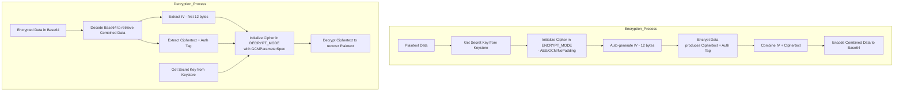

```mermaid
flowchart TD
    subgraph Encryption_Process
        A[Plaintext Data]
        B[Get Secret Key from Keystore]
        C[Initialize Cipher in ENCRYPT_MODE\n- AES/GCM/NoPadding]
        D[Auto-generate IV - 12 bytes]
        E[Encrypt Data\nproduces Ciphertext + Auth Tag]
        F[Combine IV + Ciphertext]
        G[Encode Combined Data to Base64]
        A --> B
        B --> C
        C --> D
        D --> E
        E --> F
        F --> G
    end

    subgraph Decryption_Process
        H[Encrypted Data in Base64]
        I[Decode Base64 to retrieve Combined Data]
        J[Extract IV - first 12 bytes]
        K[Extract Ciphertext + Auth Tag]
        L[Get Secret Key from Keystore]
        M[Initialize Cipher in DECRYPT_MODE\nwith GCMParameterSpec]
        N[Decrypt Ciphertext to recover Plaintext]
        H --> I
        I --> J
        I --> K
        J --> M
        K --> M
        L --> M
        M --> N
    end
```