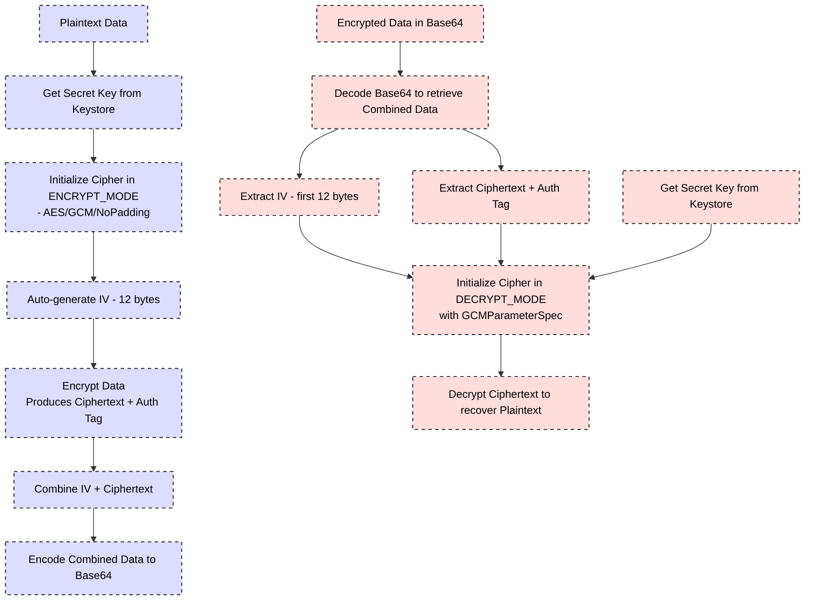

```mermaid
---
config:
  layout: fixed
---
flowchart TD
    A["Plaintext Data"] --> B["Get Secret Key from Keystore"]
    B --> C["Initialize Cipher in ENCRYPT_MODE\n- AES/GCM/NoPadding"]
    C --> D["Auto-generate IV - 12 bytes"]
    D --> E["Encrypt Data\nProduces Ciphertext + Auth Tag"]
    E --> F["Combine IV + Ciphertext"]
    F --> G["Encode Combined Data to Base64"]
    H["Encrypted Data in Base64"] --> I["Decode Base64 to retrieve Combined Data"]
    I --> J["Extract IV - first 12 bytes"] & K["Extract Ciphertext + Auth Tag"]
    J --> M["Initialize Cipher in DECRYPT_MODE\nwith GCMParameterSpec"]
    K --> M
    L["Get Secret Key from Keystore"] --> M
    M --> N["Decrypt Ciphertext to recover Plaintext"]

    H:::decryption
    I:::decryption
    J:::decryption
    K:::decryption
    L:::decryption
    M:::decryption
    N:::decryption
    A:::encryption
    B:::encryption
    C:::encryption
    D:::encryption
    E:::encryption
    F:::encryption
    G:::encryption

    classDef encryption fill:#DDF,stroke:#333,stroke-width:1.5px,stroke-dasharray: 5 5, color:#000;
    classDef decryption fill:#FDD,stroke:#333,stroke-width:1.5px,stroke-dasharray: 5 5, color:#000;


```