<p align="center">
  
</p>

# 🔐 myVault

**myVault** is an Android application that adds an extra layer of security on top of your operating system. It enables you to securely store encryption keys, images, and other sensitive files, as well as share encrypted files with authorized app users. The app leverages robust encryption techniques, biometric authentication, custom notifications, SQLite for local storage, and a carousel for smooth image navigation.

---

## ✨ Key Features

- **🛡 Layered Security:**  
  myVault creates an extra security layer by encrypting files before storage. Even if your device is compromised, your sensitive data remains protected.

- **🔑 Secure Key Storage:**  
  Uses the Android Keystore system to securely generate and store secret keys. The keys are kept in a hardware-backed container and never exposed outside the secure environment.

- **🖼 Image Vault:**  
  Save and retrieve images in a secure vault. Images are encrypted using AES/GCM (with a 12-byte IV and a built-in authentication tag) ensuring both data integrity and confidentiality.

- **📤 File Sharing:**  
  Easily share encrypted files with other app users. The app generates ephemeral keys for secure file sharing along with a timestamp header that enforces a 15-minute expiration period.

- **👆 Biometric Authentication:**  
  Access to the application is protected by biometric validation (fingerprint, face, etc.) with a fallback to device credentials (PIN/pattern/password).

- **💾 SQLite Integration:**  
  Uses SQLite to store vault entries (encrypted text and metadata), ensuring persistent and securely managed data.

- **🎠 Image Carousel:**  
  Navigate through your encrypted images using a Material Carousel for a modern, smooth, and intuitive user experience.

- **🔔 Custom Notifications:**  
  Provides custom success and error notifications to keep you informed about important operations, like saving entries, processing images, or file sharing.

---

## ⚙️ Application Architecture

### 🔐 Encryption & Key Management
- **Encryption Process:**
    1. **Initialization:**  
       Retrieve the secret key from the Android Keystore and initialize the cipher in **ENCRYPT_MODE** using AES/GCM/NoPadding.
    2. **IV Generation:**  
       A random 12-byte Initialization Vector (IV) is generated for each encryption operation. This ensures that even identical plaintexts yield different ciphertexts.
    3. **Data Encryption:**  
       The plaintext is encrypted into ciphertext while producing an authentication tag that verifies data integrity.
    4. **Data Combination:**  
       The IV is prepended to the ciphertext, and the entire data is Base64-encoded for secure storage or transmission.

- **Decryption Process:**
    1. **Data Decoding:**  
       Decode the Base64-encoded string to retrieve the combined data.
    2. **IV Extraction:**  
       Extract the first 12 bytes as the IV.
    3. **Cipher Initialization:**  
       Initialize the cipher in **DECRYPT_MODE** with the same secret key and a GCMParameterSpec (using the IV and a 128-bit tag length).
    4. **Decryption & Verification:**  
       Decrypt the ciphertext while verifying the authentication tag to ensure data integrity.

### 📂 Activities & Fragments
- **MainActivity:**  
  Manages biometric validation and bottom navigation, loading fragments like *EntriesFragment* and *ImagesFragment*.
- **FullScreenImageActivity:**  
  Displays decrypted images in full-screen mode.
- **ProcessTextActivity:**  
  Processes text entries by encrypting and storing them in SQLite.
- **ProcessImageActivity:**  
  Handles incoming image intents, encrypts images, and saves them to secure storage.
- **ShareImageActivity:**  
  Encrypts an image for sharing, generates an ephemeral decryption key, and creates a temporary file for sharing.

### 🗄 Database & File Utilities
- **SQLite Integration:**  
  Vault entries are stored in an SQLite database managed by `VaultDbHelper`.
- **File Utilities:**  
  Helper classes handle reading and writing encrypted files, ensuring proper UTF-8 encoding and safe file handling.

### 📲 UI Components
- **Carousel Layout:**  
  Implements a Material Carousel (using `CarouselLayoutManager` and `CarouselSnapHelper`) for intuitive image browsing.
- **Custom Dialogs & Notifications:**  
  Provide user feedback for operations like saving entries and deleting files.

---

## 📊 Visual Diagram

Below is a Mermaid diagram that visually represents the decryption process with icons:

```mermaid
---
config:
  layout: fixed
---
flowchart TD
    %% Encryption Process Subgraph
    subgraph Encryption_Process [Encryption Process]
        A["📄 Plaintext Data"]
        B["🔑 Get Secret Key from Keystore"]
        C["🔐 Initialize Cipher in ENCRYPT_MODE - AES/GCM/NoPadding"]
        D["⚙️ Auto-generate IV - 12 bytes"]
        E["🔒 Encrypt Data - Produces Ciphertext + Auth Tag"]
        F["🔗 Combine IV + Ciphertext"]
        G["💻 Encode Combined Data to Base64"]
    end

    %% Decryption Process Subgraph
    subgraph Decryption_Process [Decryption Process]
        H["🔐 Encrypted Data in Base64"]
        I["🔄 Decode Base64 to retrieve Combined Data"]
        J["✂️ Extract IV - first 12 bytes"]
        K["🔍 Extract Ciphertext + Auth Tag"]
        L["🔑 Get Secret Key from Keystore"]
        M["🔓 Initialize Cipher in DECRYPT_MODE with GCMParameterSpec"]
        N["📄 Decrypt Ciphertext to recover Plaintext"]
    end

    %% Connections within and between subgraphs
    A --> B
    B --> C
    C --> D
    D --> E
    E --> F
    F --> G

    H --> I
    I --> J
    I --> K
    J --> M
    K --> M
    L --> M
    M --> N

    %% Apply custom styling for encryption and decryption nodes
    class A,B,C,D,E,F,G encryption;
    class H,I,J,K,L,M,N decryption;

    classDef encryption fill:#DDF,stroke:#333,stroke-width:1.5px,stroke-dasharray: 5 5, color:#000;
    classDef decryption fill:#FDD,stroke:#333,stroke-width:1.5px,stroke-dasharray: 5 5, color:#000;
```


---

## 🚀 Installation & Usage

1. **Clone the Repository:**

   ```bash
   git clone https://github.com/AviadKorakin/Vault.git
   ```

2. **Open in Android Studio:**  
   Import the project into Android Studio and ensure your SDK and build tools are up to date.

3. **Configure Permissions:**  
   The application requests necessary permissions (e.g., POST_NOTIFICATIONS, biometric, file access) at runtime. Grant these when prompted.

4. **Run the Application:**  
   Deploy the app to your Android device or emulator.
    - **Biometric Authentication:** On launch, you'll be prompted to authenticate using biometrics.
    - **Vault Usage:** Use the intuitive UI to save encrypted text entries, images, and share encrypted files.

---

## 🛠 Customization & Extensibility

- **UI Customization:**  
  Modify the carousel, dialogs, and notifications as per your design preferences.
- **Encryption Settings:**  
  Extend or modify `EncryptionUtil` for additional algorithms or parameter adjustments.
- **Database Enhancements:**  
  Update the SQLite schema in `VaultDbHelper` to support more features or data types.
- **Notification Styling:**  
  Customize `NotificationsManager` to fit your app’s branding and notification strategy.

---

## 🤝 Contributing

Contributions are welcome! Please fork the repository and submit pull requests for enhancements, bug fixes, or new features.

---

## 🎥 Video & Audio

For an in-depth explanation, check out our audio walkthrough. (If using GitHub Pages or an external link, add a clickable link below.)

[Listen to the Explanation Audio](./assets/audio.mp3)

---