### 🔊 Click to Hear Explanation

<video controls="" autoplay="" name="media">
    <source src="https://user.github.io/project/audio/sound.mp3" type="audio/mp3">
</video>

### 🔐 Encryption & Key Management Overview

This project uses AES encryption in GCM mode (AES/GCM/NoPadding) to ensure both confidentiality and data integrity. Below is a detailed explanation of how the secret key and the overall encryption/decryption setup work, with visual cues provided by icons.

#### 🔑 Secret Key Generation and Storage

- **Key Generation:**  
  When encryption is initiated, the application checks if a secret key exists under a specific alias in secure storage. If not, it generates a new AES key using the Android Keystore system.

- **Secure Storage:**  
  The secret key is stored in a secure container provided by the operating system—the Android Keystore. This container protects cryptographic keys by:
    - Using hardware-backed security when available.
    - Preventing unauthorized extraction or tampering with the key material.

  This means that even if the device is compromised, the key remains safe because it is never exposed outside the secure container.

---

### 🔐 Encryption Process

1. **Initialization:**  
   The secret key is retrieved from the Keystore and used to initialize a cipher in **ENCRYPT_MODE** with the AES/GCM/NoPadding algorithm.

2. **IV Generation:**  
   The cipher automatically generates a random 12-byte Initialization Vector (IV).
    - **Why 12 Bytes?**  
      AES/GCM typically uses a 96-bit (12-byte) IV for optimal performance and security. The IV ensures that the same plaintext will encrypt differently each time.

3. **Data Encryption:**  
   The plaintext is encrypted, producing both the ciphertext and an authentication tag.
    - **Authentication Tag:**  
      This tag (typically 16 bytes) is generated as part of the GCM mode operation and is used to verify data integrity during decryption. If any part of the encrypted data is tampered with, the authentication tag will not match during decryption, and the process will fail.

4. **Data Combination:**  
   The IV is prepended to the ciphertext (which includes the authentication tag at its end) and then the combined data is Base64-encoded for safe storage or transmission.

---

### 🔓 Decryption Process

1. **Data Decoding:**  
   The Base64-encoded string is decoded to retrieve the combined data.

2. **IV and Ciphertext Extraction:**
    - **IV Extraction:**  
      The first 12 bytes are extracted from the decoded data as the IV.
    - **Remaining Data:**  
      The rest of the byte array is the ciphertext along with the authentication tag.

3. **Cipher Initialization:**  
   The cipher is initialized in **DECRYPT_MODE** using the same secret key from the Keystore along with a GCMParameterSpec. The GCMParameterSpec takes the extracted IV and the tag length (typically 128 bits).

4. **Decryption and Verification:**  
   The cipher decrypts the ciphertext. During this process, the authentication tag is automatically verified to ensure that the data has not been tampered with. If the tag verification fails, decryption will not proceed, ensuring data integrity.

---

### 🔄 Ephemeral Keys for Data Sharing

- **Ephemeral Key Generation:**  
  For secure data sharing, an ephemeral AES key is generated for a single encryption session.
- **Separate Transmission:**  
  This ephemeral key is Base64-encoded so it can be transmitted separately from the encrypted data.
- **Expiration Policy:**  
  A timestamp header is added to the encrypted data, enforcing an expiration period (e.g., 15 minutes) so that shared data is only accessible for a limited time.

---

### 📊 Visual Diagram

Below is the Mermaid diagram that visually represents the encryption and decryption flows with icons:

```mermaid
---
config:
  layout: fixed
---
flowchart TD
    %% Encryption Process Subgraph
    subgraph Encryption_Process [Encryption Process]
        A["📄 Plaintext Data"]
        B["🔑 Get Secret Key from Keystore"]
        C["🔐 Initialize Cipher in ENCRYPT_MODE - AES/GCM/NoPadding"]
        D["⚙️ Auto-generate IV - 12 bytes"]
        E["🔒 Encrypt Data - Produces Ciphertext + Auth Tag"]
        F["🔗 Combine IV + Ciphertext"]
        G["💻 Encode Combined Data to Base64"]
    end

    %% Decryption Process Subgraph
    subgraph Decryption_Process [Decryption Process]
        H["🔐 Encrypted Data in Base64"]
        I["🔄 Decode Base64 to retrieve Combined Data"]
        J["✂️ Extract IV - first 12 bytes"]
        K["🔍 Extract Ciphertext + Auth Tag"]
        L["🔑 Get Secret Key from Keystore"]
        M["🔓 Initialize Cipher in DECRYPT_MODE with GCMParameterSpec"]
        N["📄 Decrypt Ciphertext to recover Plaintext"]
    end

    %% Connections within and between subgraphs
    A --> B
    B --> C
    C --> D
    D --> E
    E --> F
    F --> G

    H --> I
    I --> J
    I --> K
    J --> M
    K --> M
    L --> M
    M --> N

    %% Apply custom styling for encryption and decryption nodes
    class A,B,C,D,E,F,G encryption;
    class H,I,J,K,L,M,N decryption;

    classDef encryption fill:#DDF,stroke:#333,stroke-width:1.5px,stroke-dasharray: 5 5, color:#000;
    classDef decryption fill:#FDD,stroke:#333,stroke-width:1.5px,stroke-dasharray: 5 5, color:#000;
```

---

### Detailed Breakdown of the Encrypted Data Structure

- **First 12 Bytes – Initialization Vector (IV):**
    - **Purpose:**  
      The IV is a random value that ensures each encryption operation is unique.
    - **Usage:**  
      In the decryption process, these 12 bytes are extracted and used to initialize the decryption cipher.
- **Remaining Bytes – Ciphertext + Authentication Tag:**
    - **Ciphertext:**  
      The actual encrypted data that results from processing the plaintext.
    - **Authentication Tag:**  
      Appended to the ciphertext, this tag verifies the integrity and authenticity of the ciphertext. If any alteration occurs, decryption will fail as the tag will not match the expected value.

---

### How It Works Together

- **Encryption:**  
  The system automatically generates a unique IV for every encryption operation. The IV (12 bytes) is combined with the ciphertext (including the auth tag), ensuring that even if the same plaintext is encrypted multiple times, the output is different each time.
- **Decryption:**  
  During decryption, the first 12 bytes (IV) are separated from the rest of the data. The decryption process uses this IV along with the secret key to correctly reconstruct the cipher state. Simultaneously, the authentication tag is verified to detect any tampering, thereby protecting data integrity.

